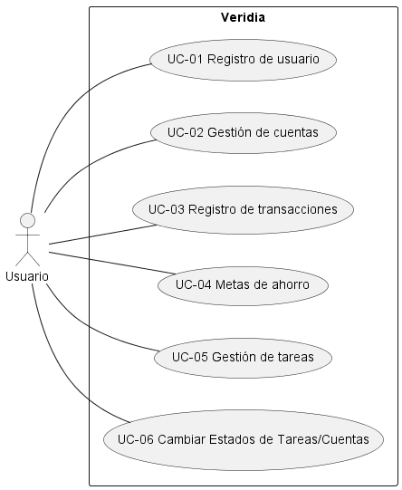
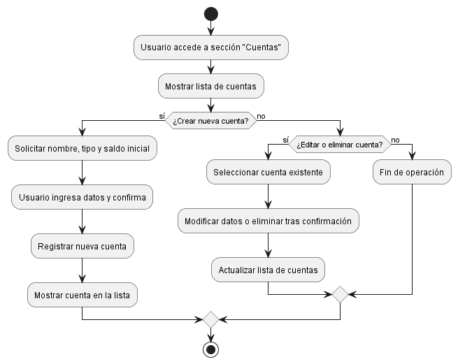

# Especificación de Caso de Uso: UC-02 – Gestión de cuentas

## 1. Nombre
UC-02 – Gestión de cuentas

## 2. Descripción
Permite al usuario crear, editar y eliminar cuentas financieras (ahorro, corriente, efectivo) para organizar su dinero en diferentes bolsillos dentro de la app Veridia.

## 3. Actores
- Usuario registrado

## 4. Precondiciones
- El usuario debe estar autenticado en la aplicación.

## 5. Flujo principal
1. El usuario accede a la sección "Cuentas".
2. El sistema muestra la lista de cuentas existentes.
3. El usuario selecciona la opción para crear una nueva cuenta.
4. El sistema solicita nombre y tipo de cuenta, y saldo inicial (opcional).
5. El usuario ingresa los datos y confirma.
6. El sistema registra la nueva cuenta y la muestra en la lista.

## 6. Flujos alternativos
- 3a. El usuario selecciona una cuenta existente para editar o eliminar.
    - El sistema permite modificar los datos o eliminar la cuenta tras confirmación.

## 7. Postcondiciones
- La cuenta queda registrada, editada o eliminada según la acción realizada.

## 8. Reglas de negocio
- No se permite duplicar nombres de cuentas para un mismo usuario.
- No se puede eliminar una cuenta con saldo negativo.

## 9. Requisitos asociados
- RF-02, RNF-MANT-01

---

# Diagrama de Casos de Uso

---

# Diagrama de Actividad del UC-02

